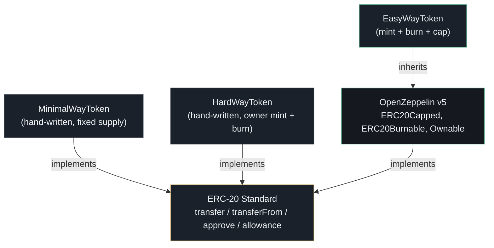
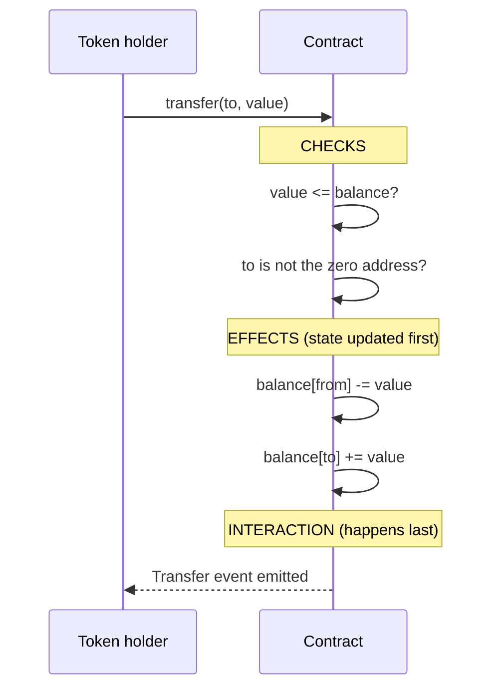

# erc20-token

A [Hardhat](https://hardhat.org/) project that builds the **same ERC-20 token three different ways** — from a minimal hand-written contract to a full-featured implementation on top of OpenZeppelin. It was built to understand what actually goes into a token standard, and to see how much of the safety net you're really buying when you reach for a library.

## What this project actually does

An ERC-20 token is a smart contract that keeps a ledger of who owns what, and lets owners move their tokens or give other addresses permission to move them on their behalf. The interface is always the same; the implementation is not. This repo answers one question: *how many ways can you build it, and what's the difference?*

1. **MinimalWayToken** — the smallest ERC-20 that's still a real token. Fixed supply, no owner, nothing extra.
2. **HardWayToken** — a hand-written ERC-20 with a capped supply, owner-only minting, and burning. Every line of logic is visible, including its rough edges.
3. **EasyWayToken** — the same idea built on OpenZeppelin's `ERC20Capped`, `ERC20Burnable`, and `Ownable`. Audited, battle-tested, and hardened — at the cost of less to learn from.

Here's how the pieces connect:



| Contract | Approach | Supply | Minting | Burning |
| --- | --- | --- | --- | --- |
| `MinimalWayToken` | Hand-written, no owner | Fixed 100M | — | — |
| `HardWayToken` | Hand-written, owner | Cap 1B, starts at 100M | Owner only | Anyone |
| `EasyWayToken` | OpenZeppelin | Cap set at deploy, starts at 100M | Owner only | Anyone |

---

## Why it's built this way

A few choices in this repo are deliberate, and worth understanding rather than just copying:

**Three tokens instead of one.**
Each implementation is a different point on the spectrum between "easy to learn from" and "safe to ship". `MinimalWayToken` strips the standard to its absolute minimum so the moving parts are obvious. `HardWayToken` adds the interesting features (minting, burning, a cap) by hand, so you see the work and the pitfalls. `EasyWayToken` shows what the same feature set looks like when someone else has already solved those pitfalls for you.

**A token transfer is a "checks, effects, interactions" sequence.**
Every transfer in this repo — and in OpenZeppelin — follows the same order: validate the inputs, update balances, then emit the event. The state is locked in before anything external is notified. This ordering is a standard defensive habit in smart contract writing.



**The cap is enforced where supply changes, not where tokens move.**
Both capped tokens check the maximum in `mint` only. Transfers don't touch the cap, because they don't change total supply — only creation of new tokens does. `EasyWayToken` also routes every mint through OpenZeppelin's `_update` hook so the `ERC20` and `ERC20Capped` checks compose correctly.

**The hand-written contracts are *deliberately* not byte-for-byte OpenZeppelin.**
That's the point of them. `HardWayToken` emits custom `Mint` and `Burn` events instead of the standard `Transfer` events from/to the zero address — a real difference you'd have to handle if you shipped it, and exactly the kind of thing OpenZeppelin's version gets right for you.

---

## What's inside the project folder

```
erc20-token/
├── contracts/
│   ├── EasyWayToken.sol       OpenZeppelin-based (capped, burnable, ownable)
│   ├── HardWayToken.sol       hand-written, owner mint + burn + cap
│   └── MinimalWayToken.sol    minimal hand-written, fixed supply
├── scripts/
│   ├── deployEasyWayToken.js
│   ├── deployHardWayToken.js
│   └── deployMinimalWayToken.js
├── test/
│   └── HardWayToken.js        deployment tests for HardWayToken
├── hardhat.config.js          project settings (Solidity 0.8.20)
├── package.json
└── README.md
```

---

## Setting it up on your own computer

### Step 1: Clone the repository

Requires [Git](https://git-scm.com/).

```bash
git clone https://github.com/PatrickMalloy/erc20-token.git
cd erc20-token
```

### Step 2: Install the dependencies

Requires [Node.js](https://nodejs.org/) 18+.

```bash
npm install
```

### Step 3: Make sure it compiles

```bash
npx hardhat compile
```

### Step 4: Run the automated tests

```bash
npx hardhat test
```

This runs the deployment checks for `HardWayToken` — that total supply equals the initial supply, the owner is set correctly, the owner receives the full initial supply, and `maximumSupply()` returns the cap. Only `HardWayToken` has tests so far; the other two tokens are covered by the deploy scripts and manual interaction.

---

## Trying it out on a fake local blockchain first

Before touching a real network, deploy to Hardhat's built-in node — a local blockchain on your own machine where nothing costs real money.

**Terminal 1 — start the node and leave it running:**

```bash
npx hardhat node
```

It prints a list of test accounts with private keys. These are public, well-known keys meant for local testing only.

**Terminal 2 — deploy one of the tokens to it:**

```bash
npx hardhat run scripts/deployMinimalWayToken.js --network localhost
npx hardhat run scripts/deployHardWayToken.js --network localhost
npx hardhat run scripts/deployEasyWayToken.js --network localhost
```

Each script prints the address your token now lives at. Copy it.

Important: every time you restart the node, its blockchain resets completely, and any token you deployed disappears. You'll need to redeploy and get a new address each time you restart.

What the scripts deploy:

- `deployEasyWayToken.js` — `EasyWayToken` with a **1 billion** token cap and a **100 million** initial mint (owner set to the second test account).
- `deployHardWayToken.js` — `HardWayToken` with a **100 million** initial supply and a **1 billion** max supply.
- `deployMinimalWayToken.js` — `MinimalWayToken` with its fixed **100 million** supply.

---

## Tools used

- Solidity, versions `0.8.20` / `^0.8.0`
- Hardhat 2.x, for compiling, testing, and deploying
- Hardhat Toolbox (`@nomicfoundation/hardhat-toolbox`), for the test harness
- OpenZeppelin Contracts v5, for the `EasyWayToken` implementation
- Ethers.js (via Hardhat), for the deploy scripts and tests

---

## Security

These contracts are educational examples. They are **not audited** and should not be deployed to production without a security review. A few things worth knowing:

- `MinimalWayToken` and `HardWayToken` are hand-rolled and miss hardened checks OpenZeppelin includes — for example, OpenZeppelin guards the zero address inside `_transfer` itself, while these contracts only check it in their public wrapper functions, and neither is built around OpenZeppelin's round-trip-safe allowance logic.
- `HardWayToken` uses `Mint`/`Burn` events instead of the standard `Transfer` events to/from the zero address. Tools that only watch `Transfer` events won't see supply changes.
- The `approve`/`transferFrom` pattern is vulnerable to the well-known ERC-20 allowance race if a spender is approved for a new amount before the old allowance is fully spent (the same tradeoff the original spec had).
- `MinimalWayToken`'s `approve` doesn't reject the zero address as spender; `HardWayToken`'s does.
- `HardWayToken`'s `_transfer` doesn't check the zero address itself — the check lives in the public `transfer`/`transferFrom` wrappers.

## License

Licensed under the [MIT](LICENSE) license.
